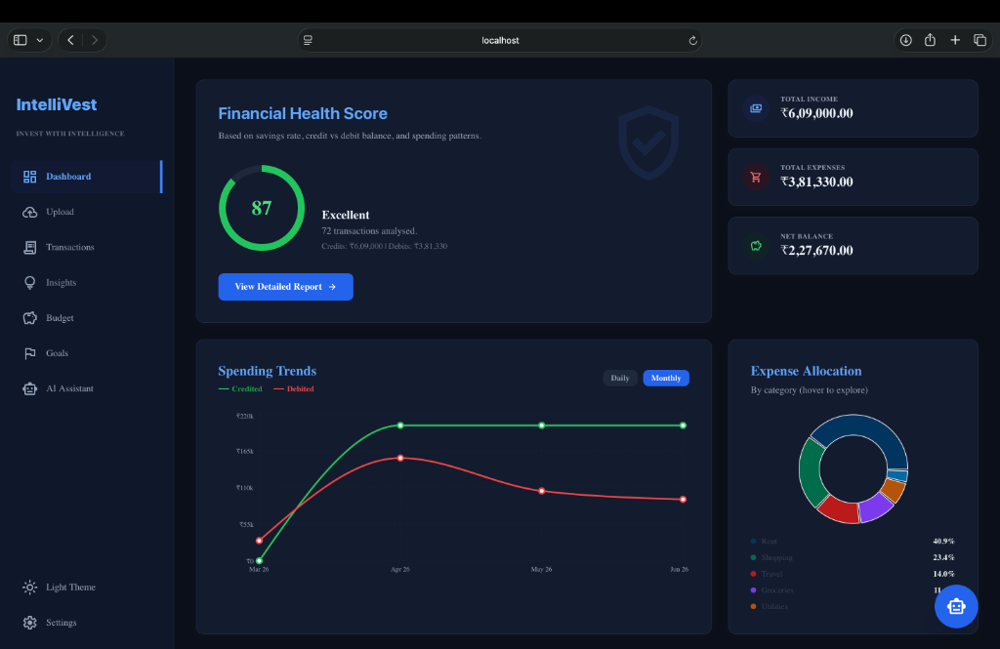
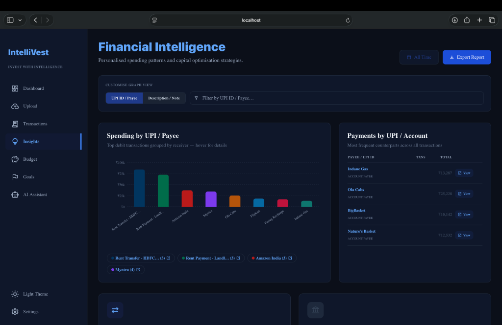
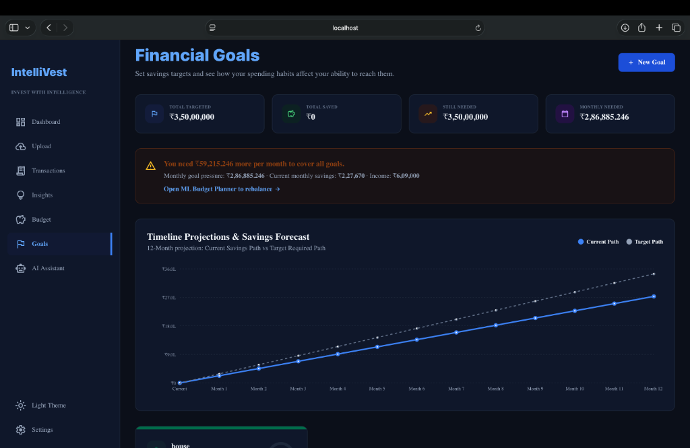
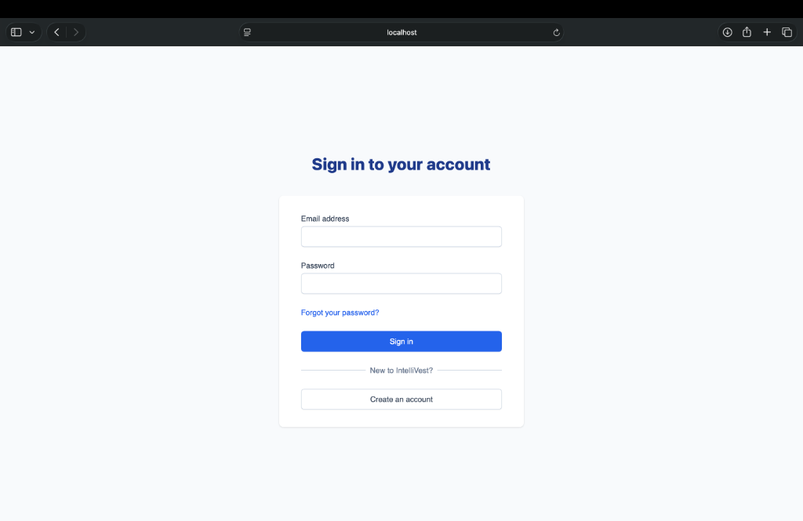
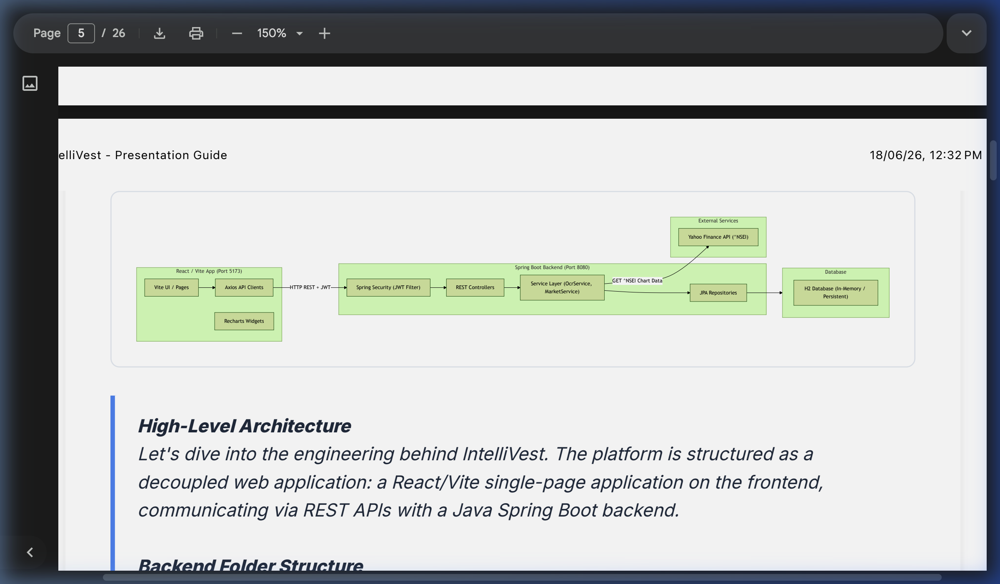

# IntelliVest: Active Financial Intelligence Platform


An AI-powered financial intelligence platform designed to help users transition from passive budgeting to active wealth generation. The app tracks spending, monitors recurring subscriptions, scans receipts using AI OCR, forecasts savings paths against goal timelines, and dynamically rebalances budget recommendations based on real-time stock market volatility.

## Screenshots & Architecture

### Dashboard


### Insights


### Goals


### Login Page


### Architecture Diagram


[](https://drive.google.com/file/d/1pHtf0zgm3v2Btx-V-Eqan_y1krGG5pn5/view?usp=sharing)
> 📄 **[Click here to view the PDF document detailing the backend mechanisms and architecture flow of the tech stack](https://drive.google.com/file/d/1pHtf0zgm3v2Btx-V-Eqan_y1krGG5pn5/view?usp=sharing).**

---

## Project Status
Under Active Development

Completed:
- Authentication
- Dashboard
- Budget Planner
- Goals Module
- OCR Pipeline

Planned:
- Real Bank Integration
- Portfolio Tracking
- Advanced ML Recommendations

---

## How to Use the App

Once you have set up and started all three microservices (Frontend, Backend, and ML Engine), here is how you can operate and interact with the application:

### 1. Unified Dashboard
* **Financial Health Score**: Check the circular SVG progress gauge on the dashboard. It measures your overall financial discipline on a scale of 0 to 100 based on savings rates, goals progress, and essentials/wants spending ratios.
* **Spending Trends**: Toggle between **daily** and **monthly** views on the interactive chart to track your historical credit vs. debit ratios.

### 2. Connect Accounts & Upload Data
* Go to the **Upload** page.
* **Scan a Receipt (AI OCR)**: Click or drag-and-drop a receipt image (e.g. Starbucks, Zomato) into the receipt upload area. The AI OCR parser will scan the file, extract the merchant, amount, category, and date, and populate an editable review form. Confirm the details to add them to your transaction ledger.
* **UPI Sandbox Simulation**: Trigger the banking sandbox mock transaction generator to instantly populate your dashboard with 50+ realistic UPI transactions for testing.

### 3. Smart Budgeting & Rebalancing
* Navigate to the **Budget** page.
* **Nifty 50 Market Indicator**: Check the live ticker showing current Nifty 50 market trends.
* **Allocation Breakdown**: Compare your actual spending against the dynamic allocations recommended by the engine for:
  * **Essentials (Needs)**: Capped at 50%.
  * **Lifestyle (Wants)**: Residual buffer balance.
  * **Savings**: Adjusted dynamically based on your goal deadlines.
  * **Investments**: Dynamically scales (5%–25%) based on market volatility and returns.
* **Rebalancing Insights**: View recommended cost-cutting measures if you exceed the target benchmarks.

### 4. Track Financial Milestones
* Open the **Goals** page.
* **Add a Goal**: Set target amounts, current saved amounts, and target deadlines (e.g., "Emergency Fund").
* **Savings Projections**: Review the line chart comparing your **Current Savings Path** (extrapolated from historical savings rates) against the **Required Target Path**. If your current savings fall below the required curve, the chart will visually flag the shortfall and months to deficit.

### 5. Chat with your Finances
* Go to the **AI Assistant** tab.
* Type natural language queries like:
  * *"How much did I spend on dining out this month?"*
  * *"Can I afford to save ₹10,000 more for my emergency fund goal?"*
  * *"List all my detected recurring subscription expenses."*
* Receive instant data-driven insights from the chatbot contextually populated with your database values.

---

## Technology Stack

* **Frontend**: Vite + React + TailwindCSS + Recharts
* **Backend**: Java Spring Boot + Maven + Spring Security (JWT) + Hibernate/JPA
* **ML Engine**: Python + FastAPI + Uvicorn + Scikit-Learn
* **Database**: PostgreSQL

---

## Setup & Installation

Follow these steps to set up the database and run the different microservices locally on your system.

### Prerequisites
* Java 17 or higher
* Node.js (v18+) and npm
* Python 3.10+
* PostgreSQL

---

### 1. Clone the Repository
```bash
git clone https://github.com/the-matchwinner/Finance_app.git
cd Finance_app
```

---

### 2. Database Setup (PostgreSQL)
The application expects a local PostgreSQL server running on port **5432** with the database `finance_db` and user credentials matching:
* **Username**: `postgres`
* **Password**: `database`

#### Setup commands (macOS via Homebrew):
1. **Install PostgreSQL**:
   ```bash
   brew install postgresql
   ```
2. **Start the database service**:
   ```bash
   brew services start postgresql
   ```
3. **Create the credentials & database**:
   Connect to the default database context and run SQL initialization:
   ```bash
   psql -d postgres -c "CREATE USER postgres WITH PASSWORD 'database' SUPERUSER;"
   psql -d postgres -c "CREATE DATABASE finance_db OWNER postgres;"
   ```

#### Setup commands (Windows):
1. **Install PostgreSQL**:
   * **Option A**: Download and run the graphical installer from the [Official PostgreSQL Downloads Page](https://www.enterprisedb.com/downloads/postgres-postgresql-downloads). During installation:
     * Set the password for the default `postgres` user to `database`.
     * Keep the port as the default `5432`.
   * **Option B**: Use Windows Package Manager (`winget`) in CMD/PowerShell:
     ```cmd
     winget install PostgreSQL.PostgreSQL
     ```
2. **Start the database service**:
   The installer automatically starts PostgreSQL as a Windows Service. If you need to start it manually, open Command Prompt as Administrator and run:
   ```cmd
   net start postgresql-x64-16
   ```
   *(Note: Replace `16` with your installed major version).*
3. **Create the Database**:
   Open **SQL Shell (psql)** from the Windows Start menu or run inside Command Prompt:
   ```cmd
   psql -U postgres -c "CREATE DATABASE finance_db OWNER postgres;"
   ```
   *(Enter the password `database` when prompted).*

---

### 3. Run the Spring Boot Backend
1. Navigate to the backend directory:
   ```bash
   cd "finace app backend"
   ```
2. Start the application:
   * **macOS / Linux**:
     ```bash
     chmod +x mvnw
     ./mvnw spring-boot:run
     ```
   * **Windows** (CMD / PowerShell):
     ```cmd
     mvnw.cmd spring-boot:run
     ```
   The backend API will start on **`http://localhost:8081`**.

---

### 4. Run the Python ML Engine
1. Navigate to the ML service directory:
   ```bash
   cd "finace app backend/ml-engine"
   ```
2. Create and activate a virtual environment:
   * **macOS / Linux**:
     ```bash
     python3 -m venv venv
     source venv/bin/activate
     ```
   * **Windows** (CMD / PowerShell):
     ```cmd
     python -m venv venv
     venv\Scripts\activate
     ```
3. Install dependencies:
   ```bash
   pip install -r requirements.txt
   ```
4. Run the FastAPI server:
   ```bash
   python main.py
   ```
   The ML engine will run on **`http://localhost:8000`**.

---

### 5. Run the Vite Frontend
1. Navigate to the frontend directory:
   ```bash
   cd "finance app frontend"
   ```
2. Install dependencies:
   ```bash
   npm install
   ```
3. Start the development server:
   ```bash
   npm run dev
   ```
   Open **`http://localhost:5173`** in your browser to view the application.
